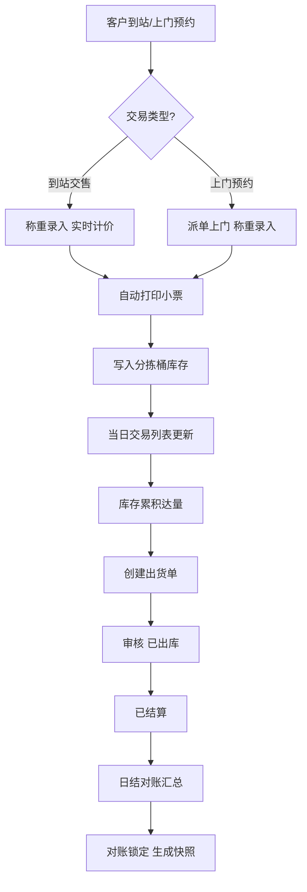

## 1. 产品概述

废品回收站管理系统是一套面向社区/街道级回收站点运营人员的桌面端 Web 管理平台。系统覆盖回收品类的浮动定价、上门预约调度、到站称重入库、分拣分类、出货销售以及日结对账全流程，帮助站点实现交易可追溯、库存可计量、收益可核对。

- **目标用户**：回收站点经营者、称重磅房操作员、分拣与仓管人员
- **核心价值**：以「定价即运营、入库即结算」为理念，将日常收散货、上门调度、销售出货与对账核算统一在一个工作台内闭环

## 2. 核心功能

### 2.1 用户角色

| 角色 | 使用场景 | 核心权限 |
|------|---------------------|------------------|
| 站长 | 定价策略、日结对账、出货审批 | 全模块读写、定价调价、对账导出 |
| 操作员（磅房） | 称重入库、到站交售、小票打印 | 入库、交易、预约改期 |
| 分拣员 | 分拣分类、库存盘点 | 库存读写、分拣记录 |

### 2.2 功能模块

1. **工作台首页**：今日 KPI 概览、近期交易曲线、待处理上门预约、库存预警、快捷操作
2. **定价管理**：品类树（纸类/塑料/金属/电器/旧衣物）、按公斤或按个定价、浮动调价历史
3. **称重入库**：到站交售交易录入、实时计价、自动打印小票、当日交易列表
4. **上门预约**：预约单看板（地址/预估重量/品类）、状态流转（待派单→已派单→已完成）、地图地址卡
5. **分拣分类**：库存分桶管理、分拣记录、库存盘点
6. **出货销售**：出货单创建（按品类批量出库）、买家与单价、出货状态流转
7. **日结对账**：当日收支汇总、收支明细、品类毛利、对账锁定

### 2.3 页面详情

| 页面名称 | 模块名称 | 功能描述 |
|-----------|-------------|---------------------|
| 工作台首页 | KPI 概览 | 当日入库重量、交易笔数、应付金额、库存总量、待办预约数 |
| 工作台首页 | 近期交易曲线 | 近 14 天入库重量与金额双轴折线图 |
| 工作台首页 | 快捷操作 | 新建到站交售、新建上门预约、调价、出货 |
| 定价管理 | 品类树 | 五大品类及其子品类的层级展示与展开 |
| 定价管理 | 定价卡片 | 单价、计价单位（公斤/个）、当前状态（启用/停用）、最近调价时间 |
| 定价管理 | 浮动调价 | 批量调价、调价历史、调价生效说明 |
| 称重入库 | 称重录入 | 选客户/品类、输入重量、实时金额、选择是否打印小票 |
| 称重入库 | 小票预览 | 80mm 小票样式预览，含站点信息/明细/合计/单号/时间 |
| 称重入库 | 当日交易 | 时间、客户、品类、重量、金额、操作（重打小票/作废） |
| 上门预约 | 预约看板 | 卡片式预约单，按状态分列 |
| 上门预约 | 预约详情 | 地址、预估重量、品类、联系方式、派单/完成/取消 |
| 分拣分类 | 库存分桶 | 按品类展示当前库存重量与件数、库位 |
| 分拣分类 | 分拣记录 | 时间、操作员、来源批次、目标库位、重量 |
| 出货销售 | 出货单 | 出货单号、买家、品类明细、重量、单价、金额、状态 |
| 出货销售 | 出货详情 | 出货清单、状态流转（草稿→已出库→已结算） |
| 日结对账 | 收支汇总 | 当日入库应付、出货应收、毛利、净利 |
| 日结对账 | 收支明细 | 按品类毛利排行、按客户排行 |
| 日结对账 | 对账锁定 | 锁定当日账目、生成对账快照 |

## 3. 核心流程

### 3.1 到站交售流程
客户到站 → 操作员选择品类 → 输入重量/件数 → 系统按当前单价实时计价 → 确认交易 → 自动打印小票 → 入库写入分拣桶 → 当日交易列表更新 → 计入日结对账。

### 3.2 上门回收流程
客户预约（地址/品类/预估重量）→ 站长看板查看 → 派单 → 司机上门称重 → 录入实际重量 → 计价结算 → 入库分拣 → 预约状态变为已完成。

### 3.3 出货销售流程
库存累积达量 → 创建出货单（选买家/品类/重量/单价）→ 审核确认 → 标记已出库 → 等待买家付款 → 标记已结算 → 计入日结对账收入。

### 3.4 日结对账流程
每日营业结束 → 进入日结页 → 系统汇总当日所有入库应付与出货应收 → 计算毛利 → 站长核对 → 锁定对账 → 生成不可篡改快照。

## 4. 用户界面设计

### 4.1 设计风格

- **主题方向**：工业环保风（Industrial Eco）——以深炭灰底色搭配苔藓绿与安全琥珀色，传递「回收再利用」的工业感与生命力的平衡
- **主色**：苔藓绿 `#5C7A4F`（操作/正向）
- **强调色**：安全琥珀 `#E8A33D`（金额/警示/待办）
- **危险色**：砖红 `#C24D4D`（作废/亏损）
- **背景色**：炭灰 `#1A1D1A` / 卡片 `#232622`
- **字体**：标题使用 `Bebas Neue`（粗壮工业感），正文使用 `Noto Sans SC`，数字与表格使用 `JetBrains Mono`
- **按钮风格**：圆角 6px、实色填充、轻微投影、悬浮上移
- **布局风格**：左侧固定侧边导航 + 顶部状态条 + 右侧主内容区，卡片式工作台
- **图标风格**：线性描边图标，统一 1.5px 描边，配合品类色

### 4.2 页面设计概览

| 页面名称 | 模块名称 | UI 元素 |
|-----------|-------------|-------------|
| 工作台首页 | KPI 卡片 | 4 张数据卡，左侧大数字 JetBrains Mono，右侧图标与环比箭头，悬浮发光描边 |
| 工作台首页 | 交易曲线 | 双轴折线图，琥珀色为金额、绿色为重量，网格线半透明 |
| 定价管理 | 品类树 | 左侧树形导航，五大品类带品类色圆点，展开显示子品类 |
| 定价管理 | 定价卡片 | 网格卡片，顶部品类色横条，单价大号字体，底部调价按钮 |
| 称重入库 | 称重面板 | 中央大号电子秤数字显示，下方品类选择与重量输入，右侧实时金额与打印预览 |
| 称重入库 | 小票预览 | 80mm 宽白底小票样式，等宽字体，虚线分割，二维码占位 |
| 上门预约 | 预约看板 | 三列看板（待派单/进行中/已完成），卡片含地址徽章与品类标签 |
| 分拣分类 | 库存分桶 | 表格视图，品类色行徽章、进度条显示库容占比 |
| 出货销售 | 出货单列表 | 表格行展开式，状态徽章用色彩区分 |
| 日结对账 | 汇总面板 | 顶部三大数字（应付/应收/毛利），下方分项明细与品类毛利柱状图 |

### 4.3 响应式

- 桌面优先设计，最小宽度 1280px
- 1366px 及以上完整展示三栏看板与表格
- 移动端仅作基本可用降级（不作为主场景）

### 4.4 打印小票样式

- 80mm 热敏打印纸宽度
- 单色黑字白底
- 等宽字体居中标题
- 虚线分隔明细与合计
- 底部 16 位单号 + 打印时间
- 浏览器 `@media print` 隔离其他元素
