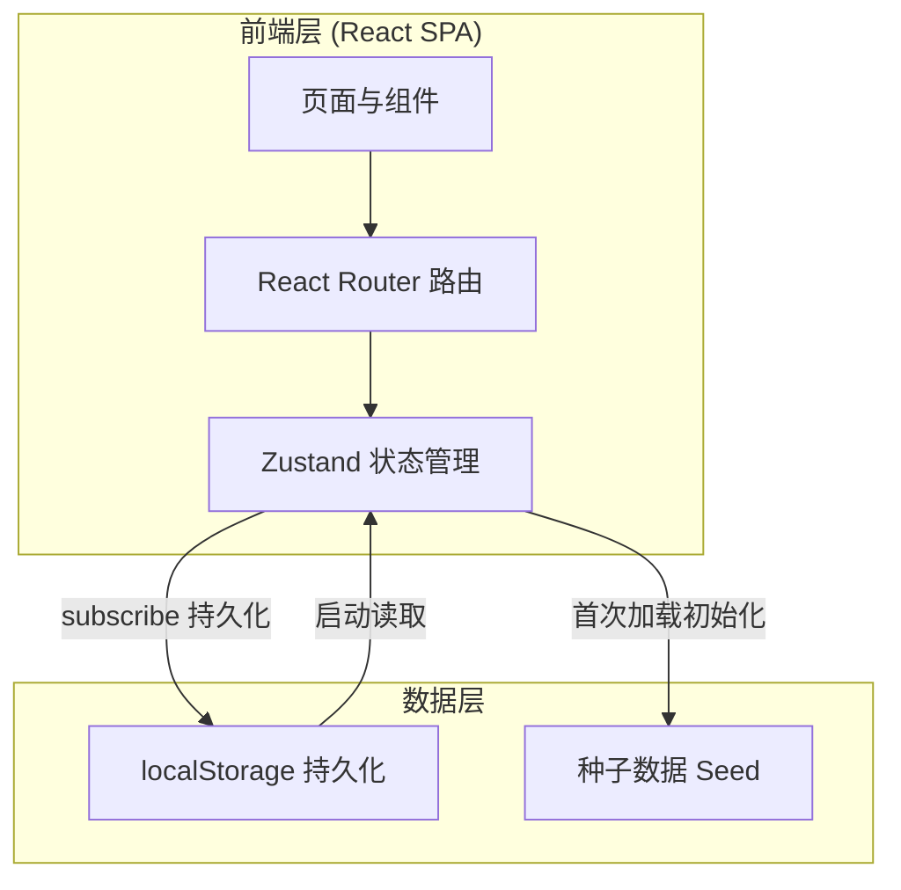
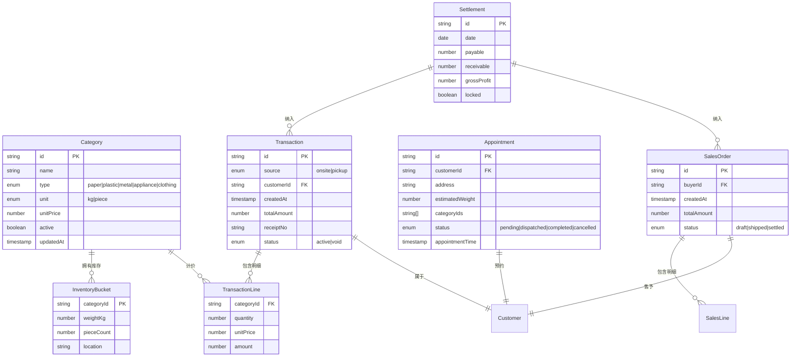

## 1. 架构设计

本系统为纯前端单页应用，数据持久化采用浏览器 `localStorage`，无需后端服务。所有状态由 Zustand 统一管理，并通过订阅器自动同步到本地存储，实现刷新不丢失。



## 2. 技术描述

- **前端**：React@18 + TypeScript + Vite@5
- **样式**：TailwindCSS@3 + CSS 变量主题
- **状态管理**：Zustand@4（含 persist 中间件）
- **路由**：React Router DOM@6
- **图表**：Recharts@2
- **日期**：date-fns@3
- **图标**：lucide-react
- **打印**：浏览器原生 `window.print()` + `@media print` CSS
- **数据存储**：localStorage（无后端）
- **初始化工具**：vite-create（react-ts 模板）

## 3. 路由定义

| 路由 | 用途 |
|-------|---------|
| `/` | 重定向到 `/dashboard` |
| `/dashboard` | 工作台首页 |
| `/pricing` | 定价管理 |
| `/intake` | 称重入库（到站交售） |
| `/appointments` | 上门预约看板 |
| `/sorting` | 分拣分类与库存 |
| `/sales` | 出货销售 |
| `/settlement` | 日结对账 |

## 4. 状态管理设计

Zustand store 划分为以下切片（slice）：

```typescript
interface AppState {
  categories: Category[];        // 品类与定价
  inventory: InventoryBucket[];   // 库存分桶
  transactions: Transaction[];    // 入库交易
  appointments: Appointment[];     // 上门预约
  salesOrders: SalesOrder[];      // 出货单
  settlements: Settlement[];      // 日结对账快照
  customers: Customer[];          // 客户档案
  station: StationInfo;           // 站点信息（小票抬头）
}
```

各切片均通过 `persist` 中间件写入 `localStorage`，键名 `recycle-station-db`。

## 5. 数据模型

### 5.1 数据模型定义



### 5.2 数据定义语言（localStorage 结构）

存储于 `localStorage.recycle-station-db`，JSON 结构如下：

```json
{
  "state": {
    "station": {
      "name": "绿源回收 · 城东站",
      "address": "杭州市江干区凯旋路 268 号",
      "phone": "0571-8800-1234",
      "license": "HZ-REC-2024-0156"
    },
    "categories": [
      {
        "id": "cat_paper_cardboard",
        "parentId": "cat_paper",
        "name": "黄板纸",
        "type": "paper",
        "unit": "kg",
        "unitPrice": 1.10,
        "active": true,
        "updatedAt": 1718841600000,
        "priceHistory": [
          { "price": 0.90, "at": 1716163200000 },
          { "price": 1.00, "at": 1717804800000 }
        ]
      }
    ],
    "transactions": [
      {
        "id": "T20260620001",
        "source": "onsite",
        "customerId": "cust_001",
        "customerName": "张师傅",
        "createdAt": 1718841600000,
        "totalAmount": 35.20,
        "receiptNo": "20260620-001",
        "status": "active",
        "lines": [
          {
            "categoryId": "cat_paper_cardboard",
            "categoryName": "黄板纸",
            "unit": "kg",
            "quantity": 32,
            "unitPrice": 1.10,
            "amount": 35.20
          }
        ]
      }
    ]
  }
}
```

## 6. 打印小票方案

- 小票组件渲染在隐藏容器内，使用 `position: fixed; left: -9999px` 平时不可见
- 调用打印时通过 `@media print` 仅显示 `.receipt-print-area`，隐藏其余 DOM
- 单号格式：`YYYYMMDD-NNN`，按当日序号自增
- 小票内容：站点名/地址/电话、单号、客户、明细表（品类/单位/数量/单价/金额）、合计、打印时间
